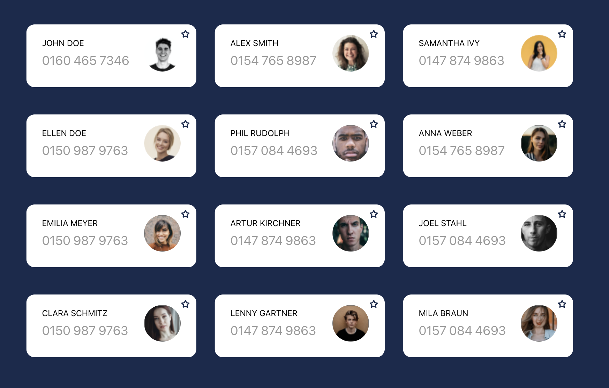

# CodeJunkie - JS Frontend Assignment

This project is a template for the assignment.
To run the project

### `yarn install`

and then

### `yarn start`

## General rules for the assignment:

- Try to stick to the given structure
- Please don't use any other assets. You are free to modify the given assets though.
- Use Typescript
- Try to get as close as possible to the given target result. Share whatever you have even if it doesn't work (it needs to compile though). Your approach is more important than completing it.
- When you are done, simply create a pull-request

## Assignment

1. Create a partly responsive single page application, displaying the contacts, that are stored in the object ContactsStore.tsx -> contacts.
   

2. Implement the interaction shown in the following gif
   
   - Favourite button
   - Drag and Drop (card tilted on drag)
   - Reorder with Drag

### Bonus:

If you find the time and are excited about animations; you can implement the contact cards animate while reordering, instead of jumping to their position.
